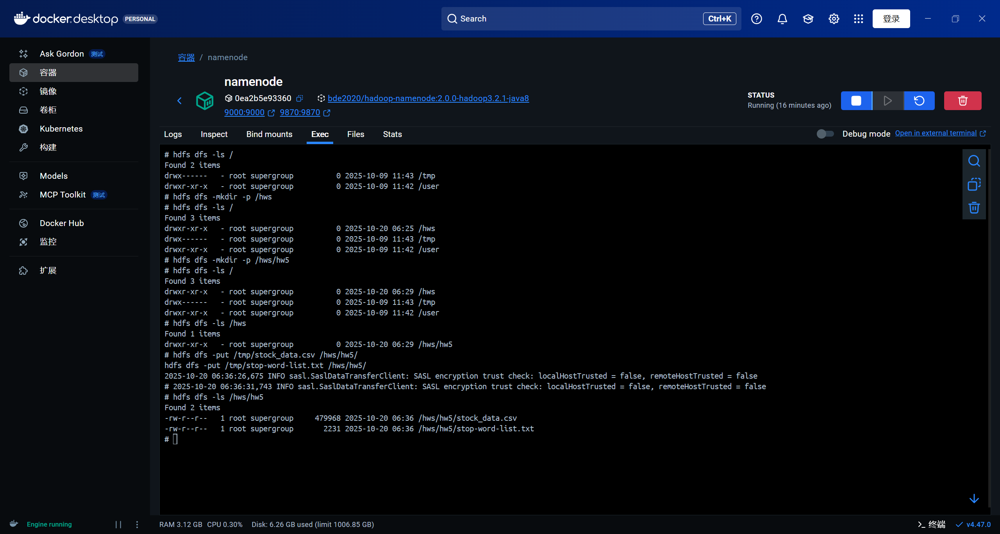
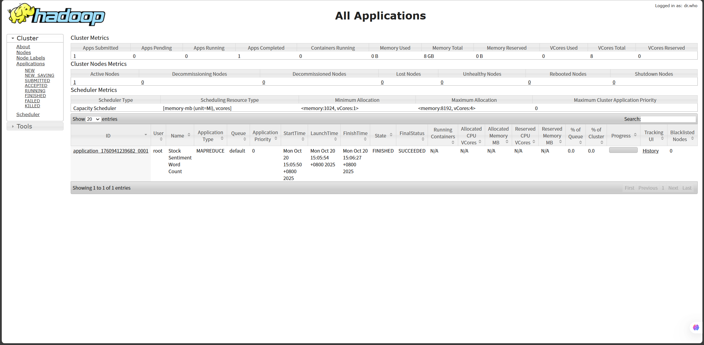
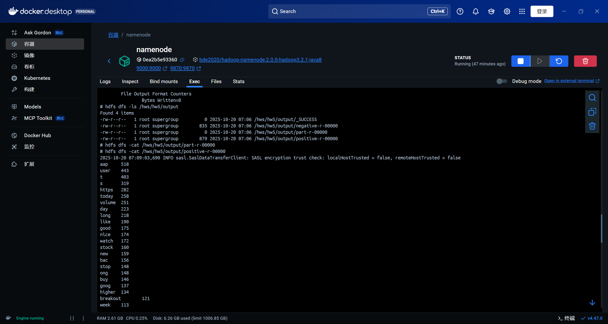

# Stock Sentiment Word Count

## 1. 设计思路

本程序使用 **Hadoop MapReduce** 框架，对股票新闻数据集 `stock_data.csv` 进行情感分类下的词频统计，分别输出正面（标签为 `1`）和负面（标签为 `-1`）新闻标题中出现频率最高的前 100 个单词。

### Mapper 阶段
- 使用 `DistributedCache` 加载停用词文件 `stop-word-list.txt`，在 `setup()` 中初始化停用词集合。
- 每行输入格式为 `<Text>,<Sentiment>`。为避免标题中包含逗号，**从后往前查找最后一个逗号**，正确分离文本与标签。
- 对文本进行清洗：
    - 转为小写
    - 移除所有非字母字符（保留空格）
    - 按空白符分词
    - 过滤空词和停用词
- 输出键值对：`<sentiment> → <word>`（如 `"1" → "stock"`）

### Reducer 阶段
- 使用 `MultipleOutputs` 将结果分别写入 `positive` 和 `negative` 两个逻辑输出。
- 对每个情感类别内的所有单词进行**本地词频统计**（使用 `HashMap`）。
- 将统计结果按频次**降序排序**，取前 100 项。
- 输出格式为：`<word>\t<count>`，符合作业要求。

### 其他设计
- 程序通过命令行接收三个参数：`<input> <output> <stopword_file>`
- 停用词文件通过 `DistributedCache` 分发，确保每个 Task 节点都能访问。

---

## 2. 程序运行环境

- **Hadoop 版本**：3.3.6（Docker 集群，基于 `bde2020/hadoop-*` 镜像）
- **Java 版本**：JDK 8（确保 JAR 与 Hadoop 环境兼容）
- **编译工具**：Maven
- **输入数据**：
    - `stock_data.csv`：6090 条新闻标题及情感标签
    - `stop-word-list.txt`：标准英文停用词表

---

## 3. 运行命令

在 Hadoop 集群的 NameNode 容器中执行：

```bash
hadoop jar target/StockSentimentWordCount-1.0-SNAPSHOT.jar \
  StockWordCount \
  /hws/hw5/stock_data.csv \
  /hws/hw5/output \
  /hws/hw5/stop-word-list.txt
```

> 注意：输出目录 `/hws/hw5/output` 在运行前必须不存在。

---

## 4. 运行结果

程序成功生成两个结果文件：

- `output/positive/part-r-00000`：正面新闻高频词 Top 100
- `output/negative/part-r-00000`：负面新闻高频词 Top 100

**文件格式示例**：
```
stock	120
market	98
company	87
...
```

- 每个文件 **恰好 100 行**
- 单词均为小写，无标点、数字、停用词
- 使用 **制表符（`\t`）** 分隔单词与频次

---

## 5. Web UI 截图

作业在 YARN 上成功运行，状态为 **SUCCEEDED**。





---

## 6. 不足与改进方向

### 当前不足
- **Reducer 内存压力大**：所有单词在 Reducer 内存中排序，若某类单词量极大（如百万级），可能导致 OOM。
- **未使用 Combiner**：Map 端未做局部聚合，网络传输数据量较大。
- **TopK 排序在 Reducer 单点完成**：无法利用多 Reducer 并行处理。

### 可能的改进
1. **引入 Combiner**：在 Map 端对同一 `<sentiment, word>` 做局部计数，减少 shuffle 数据量。
2. **使用 TopK Reducer 模式**：通过二次排序或 TreeMap 维护 Top 100，避免全量排序。
3. **支持多 Reducer**：按单词首字母分区，每个 Reducer 输出局部 Top 100，再用额外 Job 合并全局 Top 100。
4. **使用 Hadoop 3+ 的 `@InterfaceStability` 兼容 API**：替换已废弃的 `DistributedCache`（当前代码使用的是旧 API，但在 Hadoop 3 中仍可用）。

---

## 7. 项目结构说明

```
StockSentimentWordCount/
├── src/                          # 源代码
├── target/
│   └── StockSentimentWordCount-1.0-SNAPSHOT.jar  # 可执行 JAR
├── output/
│   ├── positive/positive-r-00000     # 正面 Top 100
│   └── negative/negative-r-00000     # 负面 Top 100
├── pom.xml                       # Maven 配置
├── .gitignore                    # 忽略编译中间文件
└── README.md                     # 本文档
```
